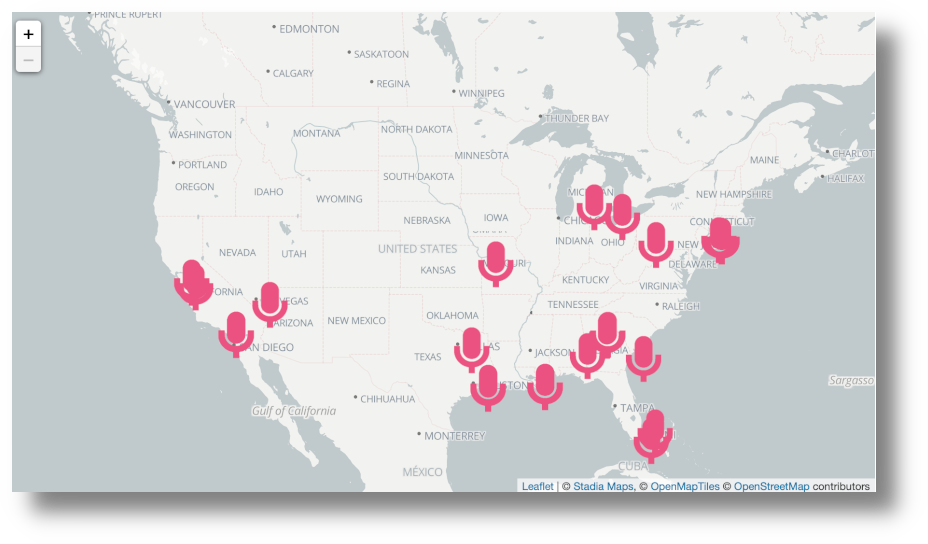

# Data Visualization Project for Murdered Hip-hop Artists

A table of murdered hip-hop artists was scraped from wikipedia [here](https://en.wikipedia.org/wiki/List_of_murdered_hip_hop_musicians). The resulting data set gave the name, date, place by city and state, cause of death and age at the time of death. The data set was subset to those deaths occurring in the United States.The project imported a "geojson" file and used customized icons. A total of 36 artists were identified as being "shot and killed." One artist's death was described as being "shot and run over."

## License

Distributed under the MIT License. See `LICENSE` for more information.

## Contact

Rob Wiederstein - [@https://twitter.com/RobWiederstein](https://twitter.com/your_username) - rob@robwiederstein.org

Project Link: <https://github.com/RobWiederstein/sample-R-workflow>

## Acknowledgements

Icon was created using the [Noun Project](https://thenounproject.com).
